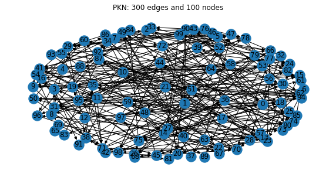
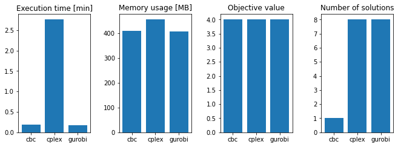
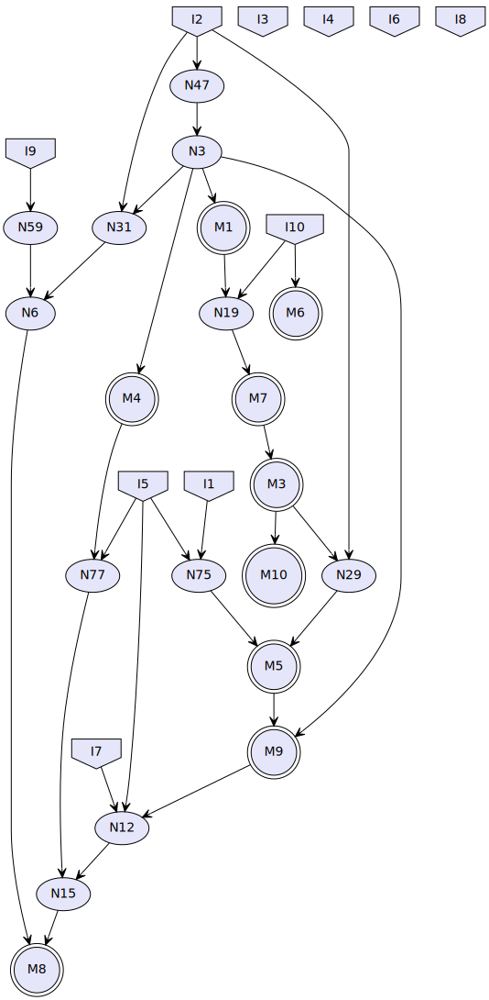
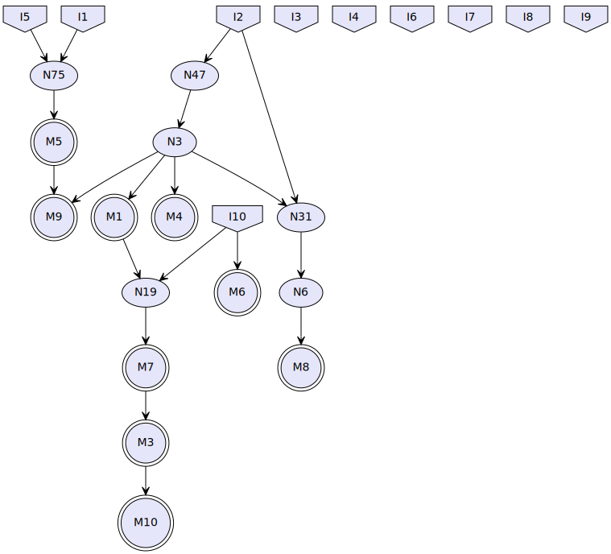
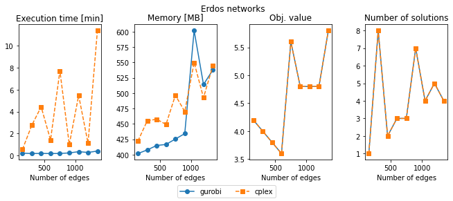
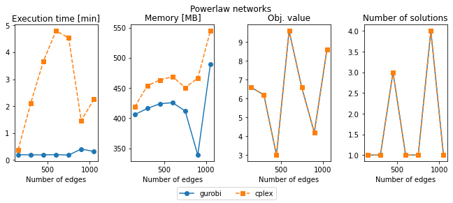

# Benchmark Gurobi

This repository is for testing and benchmarking the gurobi implementation within CARNIVAL.

# Setup

In this section, we go though the setup necessary to run this notebook. 

## Conda environment

If anaconda is available on the cluster, then load that through module:
```
module load Anaconda3
```
Or follow the instructions on [Miniconda website](https://docs.conda.io/en/latest/miniconda.html).

Then create a conda environment based on the `conda_env.yml` file in this repository using:
```
conda env create -p ./conda_env --file conda_env.yml
```

## Snakemake

To generate this notebook run snakemake:
```
snakemake -j10 --cluster "sbatch -c1 --mem 5G -t 2:00:00"
```


```python
# %matplotlib notebook
%matplotlib inline
%load_ext rpy2.ipython
from IPython.display import Image
import graphviz
import matplotlib.pyplot as plt
import networkx as nx
import numpy as np
import pandas as pd
import pydotplus
from pyvis.network import Network
import rpy2.robjects as robjects
from rpy2.robjects import pandas2ri
from IPython.core.display import display, HTML
pandas2ri.activate()
readRDS = robjects.r['readRDS']


class SolverLogs(object):
    def __init__(self, filenames):
        self.__data__ = {x: getattr(self, f"__get_{x}__")(y) for x, y in filenames.items()}

    def __getitem__(self, key):
        return self.__data__[key]
    
    def get_data(self):
        return self.__data__
        
    def __get_cbc__(self, path_to_log):
        obj_val = 0
        with open(path_to_log) as fh:
            for line in fh:
                if "Objective value:" in line:
                    obj_val = float(line.split("Objective value:")[-1].strip("\n "))
        return {"objective_value": obj_val, "solution_count": 1}
    
    def __get_cplex__(self, path_to_log):
        obj_val = 0
        sol_count = 0
        with open(path_to_log) as fh:
            for line in fh:
                if "Objective = " in line:
                    obj_val = float(line.split("Objective = ")[-1].strip("\n "))
                if "Solution pool:" in line:
                    sol_count = int(line.split(" ")[2])
        return {"objective_value": obj_val, "solution_count": sol_count}

    def __get_gurobi__(self, path_to_log):
        obj_val = 0
        sol_count = 0
        with open(path_to_log) as fh:
            for line in fh:
                if "Best objective" in line:
                    obj_val = float(line.split(",")[0].split("Best objective")[-1].strip("\n "))
                if "Solution count" in line:
                    sol_count = int(line.split(":")[0].split(" ")[-1])
        return {"objective_value": obj_val, "solution_count": sol_count}
```

# Example 


```python
dirname = "Output/Erdos/E300_N100_I10_M10_S1_P2_2/"
g = nx.drawing.nx_agraph.read_dot(f"{dirname}graph.dot")
pos = nx.spring_layout(g, 2.5, iterations=100)
fig, ax = plt.subplots(figsize=(10, 5))
ax.set_title("PKN: 300 edges and 100 nodes")
nx.draw(g, pos, ax, with_labels=True)
```





```python
solvers = ("cbc", "cplex", "gurobi")
titles = ("Execution time [min]", "Memory usage [MB]" , "Objective value", "Number of solutions")

logs = SolverLogs({x: f"{dirname}{x}/log.txt" for x in solvers}).get_data()
benchmarks = {x: pd.read_csv(f"{dirname}{x}/benchmark.tsv", "\t") for x in solvers}

fig, axs = plt.subplots(1, 4, figsize=(10, 4))
fig.subplots_adjust(wspace=0.4, left=0.07, right=0.93, bottom=0.2)
for ax, t in zip(axs, titles): ax.set_title(t)
axs[0].bar(solvers, [benchmarks[x]["s"].mean()/60 for x in solvers])
axs[1].bar(solvers, [benchmarks[x]["max_rss"].mean() for x in solvers])
axs[2].bar(solvers, [logs[x]["objective_value"] for x in solvers])
axs[3].bar(solvers, [logs[x]["solution_count"] for x in solvers])
```


    <BarContainer object of 3 artists>





cplex | gurobi
- | -
 | 

# Results


```python
def get_results(edges, nodes, solver, network_type, num_in=10, num_meas=10):
    dirname = f"Output/{network_type}/E{edges}_N{nodes}_I{num_in}_M{num_meas}_S1_P2_2/"

    logs = SolverLogs({solver: f"{dirname}{solver}/log.txt"}).get_data()
    benchmarks = {solver: pd.read_csv(f"{dirname}{solver}/benchmark.tsv", "\t")}
    res = [benchmarks[solver]["s"].mean()/60, 
           benchmarks[solver]["max_rss"].mean(),
           logs[solver]["objective_value"], 
           logs[solver]["solution_count"]]
    return res
```

## Erdos networks

The PKN given to CARNIVAL is generated with `igraph::erdos.renyi.game()` function from [igraph](https://igraph.org/) package.


```python
col_names = ["Execution time [min]", "Memory [MB]", "Obj. value", "Number of solutions"]
num_nodes = np.arange(50, 500, 50)
df_gurobi = pd.DataFrame([get_results(3*x, x, "gurobi", "Erdos") for x in num_nodes], columns=col_names)
df_cplex = pd.DataFrame([get_results(3*x, x, "cplex", "Erdos") for x in num_nodes], columns=col_names)

fig, axs = plt.subplots(1, 4, figsize=(10, 4))
fig.subplots_adjust(wspace=0.4, left=0.07, right=0.93, bottom=0.2)
for i, x in enumerate(col_names):
    axs[i].plot(3*num_nodes, df_gurobi[x], "o-")
    axs[i].plot(3*num_nodes, df_cplex[x], "s--")
    axs[i].set_xlabel("Number of edges")
    axs[i].set_title(x)
fig.legend(axs[-1].lines, ["gurobi", "cplex"], loc="lower center", ncol=2)
fig.suptitle("Erdos networks")
```


    Text(0.5, 0.98, 'Erdos networks')





## Powerlaw networks

The PKN given to CARNIVAL is generated with `igraph::static.power.law.game()` function from [igraph](https://igraph.org/) package.


```python
col_names = ["Execution time", "Memory", "Obj. value", "Number of solutions"]
num_nodes = np.arange(50, 400, 50)
df_gurobi = pd.DataFrame([get_results(4*x, x, "gurobi", "Powerlaw") for x in num_nodes], columns=col_names)
df_cplex = pd.DataFrame([get_results(4*x, x, "cplex", "Powerlaw") for x in num_nodes], columns=col_names)

fig, axs = plt.subplots(1, 4, figsize=(10, 4))
fig.subplots_adjust(wspace=0.4, left=0.07, right=0.93, bottom=0.2)
for i, x in enumerate(col_names):
    axs[i].plot(3*num_nodes, df_gurobi[x], "o-")
    axs[i].plot(3*num_nodes, df_cplex[x], "s--")
    axs[i].set_title(x)
    axs[i].set_xlabel("Number of edges")
fig.legend(axs[-1].lines, ["gurobi", "cplex"], loc="lower center", ncol=2)
fig.suptitle("Powerlaw networks")
```


    Text(0.5, 0.98, 'Powerlaw networks')




