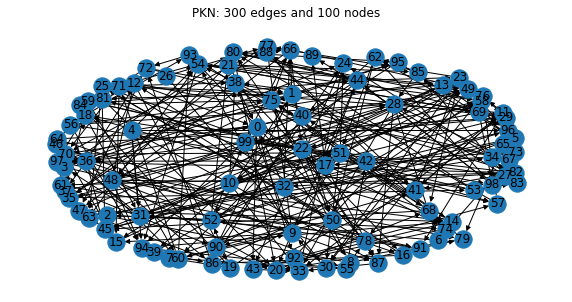

# Benchmark Gurobi

This repository is for testing and benchmarking the gurobi implementation within CARNIVAL.

We have implemented the gurobi ILP solver into CARNIVAL. To compare the performance of gurobi solver, we have ran benchmarks on synthetic prior knowledge networks (PKNs) generated using the `igraph` package. We generated two types of PKNs: Erdos-Renyi and powerlaw. Once the PKNs have been generated, we run CARNIVAL with the following parameters using cplex and gurobi ILP solvers:

* mipGAP = 0.05,
* poolrelGAP = 1e-04,
* limitPop = 500,
* poolCap = 100,
* poolIntensity = 4,
* poolReplace = 2,
* alphaWeight = 1,
* betaWeight = 0.2.

# Setup

In this section, we go though the setup necessary to run this notebook. 

## Conda environment

If anaconda is available on the cluster, then load that through module:
```
module load Anaconda3
```
Or follow the instructions on [Miniconda website](https://docs.conda.io/en/latest/miniconda.html).

Then create a conda environment based on the `conda_env.yml` file in this repository using:
```
conda env create -n bq_dev -f conda_env.yml
```

## Snakemake

To generate this report run snakemake:
```
snakemake --profile Slurm --resources load=1
```

## Load packages


```python
%matplotlib inline
%load_ext rpy2.ipython
from IPython.display import HTML, display
import matplotlib.pyplot as plt
import networkx as nx
import numpy as np
import pandas as pd
import pydotplus
from pyvis.network import Network
import rpy2.robjects as robjects
from rpy2.robjects import pandas2ri
from Scripts.read_logs import SolverLogs, get_results


pandas2ri.activate()
readRDS = robjects.r['readRDS']
plt.rcParams.update({"savefig.format": "svg", "savefig.transparent": True})
```

# Example


```python
dirname = "Output/Erdos/E300_N100_I10_M10_S1/"
g = nx.drawing.nx_agraph.read_dot(f"{dirname}carnival_input.dot")
pos = nx.spring_layout(g, 2.5, iterations=100)
fig, ax = plt.subplots(figsize=(10, 5))
ax.set_title("PKN: 300 edges and 100 nodes")
nx.draw(g, pos, ax, with_labels=True)
```





```python
dirname = "Output/Erdos/E600_N200_I10_M10_S1/"
solvers = ("cbc", "cplex", "gurobi")
titles = ("Execution time [min]", "Memory usage [MB]" , "Objective value", "Number of solutions")

logs = {x: SolverLogs(x, f"{dirname}{x}_N1/log.txt").get_data() for x in solvers}
benchmarks = {x: pd.read_csv(f"{dirname}{x}_N1/benchmark.tsv", "\t") for x in solvers}

fig, axs = plt.subplots(1, 4, figsize=(10, 4))
fig.subplots_adjust(wspace=0.4, left=0.07, right=0.93, bottom=0.2)
for ax, t in zip(axs, titles): ax.set_title(t)
axs[0].bar(solvers, [benchmarks[x]["s"].mean()/60 for x in solvers])
axs[1].bar(solvers, [benchmarks[x]["max_rss"].mean() for x in solvers])
axs[2].bar(solvers, [logs[x]["objective_value"] for x in solvers])
axs[3].bar(solvers, [logs[x]["solution_count"] for x in solvers])
```


    <BarContainer object of 3 artists>


# Results

## Erdos networks

The Erdos-Renyi PKNs were generated using `igraph::erdos.renyi.game` function, with three times the number of edges given the number of nodes in the PKN. Figure below shows the results of these benchmarks. Both solvers (cplex and gurobi), return the same number of solutions and the same best value of objective function. Where the two solvers differ is in the execution time and memory consumption. We see in figure below that execution time of CARNIVAL when using gurobi solver is much better when compared to using cplex as the solver. Similarly for memory consumption, we see that gurobi has lower usage, except for the largest three PKNs.


```python
num_nodes = np.arange(50, 1050, 50)
df_gurobi = pd.DataFrame([get_results(3*x, x, "gurobi", "Erdos", seed=1) for x in num_nodes])
df_cplex = pd.DataFrame([get_results(3*x, x, "cplex", "Erdos", seed=1) for x in num_nodes])

fig, axs = plt.subplots(1, 4, figsize=(10, 4))
fig.subplots_adjust(wspace=0.4, left=0.07, right=0.93, bottom=0.2)
for i, x in enumerate(df_gurobi.columns):
    axs[i].plot(3*num_nodes, df_gurobi[x], "o-")
    axs[i].plot(3*num_nodes, df_cplex[x], "s--")
    axs[i].set_xlabel("Number of edges")
    axs[i].set_title(x)
fig.legend(axs[-1].lines, ["gurobi", "cplex"], loc="lower center", ncol=2)
fig.suptitle("Erdos networks")
fig.savefig("Images/benchmarks_erdos_small")
```


Same as above, but for bigger networks


```python
num_nodes = np.arange(1, 6) * 1000
df_gurobi = pd.DataFrame([get_results(3*x, x, "gurobi", "Erdos", seed=1) for x in num_nodes])
df_cplex = pd.DataFrame([get_results(3*x, x, "cplex", "Erdos", seed=1) for x in num_nodes])

fig, axs = plt.subplots(1, 4, figsize=(10, 4))
fig.subplots_adjust(wspace=0.4, left=0.07, right=0.93, bottom=0.2)
for i, x in enumerate(df_gurobi.columns):
    axs[i].plot(3*num_nodes, df_gurobi[x], "o-")
    axs[i].plot(3*num_nodes, df_cplex[x], "s--")
    axs[i].set_xlabel("Number of edges")
    axs[i].set_title(x)
fig.legend(axs[-1].lines, ["gurobi", "cplex"], loc="lower center", ncol=2)
fig.suptitle("Erdos networks")
fig.savefig("Images/benchmarks_erdos_medium")
```


## Powerlaw networks

The powerlaw PKNs were generated using `igraph::static.power.law.game` function, with four times the number of edges given the number of nodes in the PKN. Figure below shows a similar results to the benchmarks with Erdos-Renyi PKNs, namely gurobi outperforms cplex with respect to execution time and memry consumption. The same number of solutions was given by CARNIVAL with cplex and gurobi, as well as the best objective function value.


```python
col_names = ["Execution time [min]", "Memory [MB]", "Obj. value", "Number of solutions"]
num_nodes = np.arange(50, 400, 50)
df_gurobi = pd.DataFrame([get_results(4*x, x, "gurobi", "Powerlaw", seed=1) for x in num_nodes])
df_cplex = pd.DataFrame([get_results(4*x, x, "cplex", "Powerlaw", seed=1) for x in num_nodes])

fig, axs = plt.subplots(1, 4, figsize=(10, 4))
fig.subplots_adjust(wspace=0.4, left=0.07, right=0.93, bottom=0.2)
for i, x in enumerate(df_gurobi.columns):
    axs[i].plot(3*num_nodes, df_gurobi[x], "o-")
    axs[i].plot(3*num_nodes, df_cplex[x], "s--")
    axs[i].set_title(x)
    axs[i].set_xlabel("Number of edges")
fig.legend(axs[-1].lines, ["gurobi", "cplex"], loc="lower center", ncol=2)
fig.suptitle("Powerlaw networks")
fig.savefig("Images/benchmarks_powerlaw_small")
```


## Distributed optimization

Using gurobi distributed optimization


```python
num_nodes = np.arange(1, 10)  # compute nodes on the cluster
res = [get_results(3000, 1000, "gurobi", "Erdos", seed=1, parallel=x)
       for x in range(1, 10)]
df_gurobi = pd.DataFrame(res)

fig, axs = plt.subplots(1, 4, figsize=(10, 4))
fig.subplots_adjust(wspace=0.4, left=0.07, right=0.93, bottom=0.2)
for i, x in enumerate(df_gurobi.columns):
    axs[i].plot(num_nodes, df_gurobi[x], "o-")
    axs[i].set_xlabel("Compute nodes")
    axs[i].set_title(x)
    axs[i].set_xticks(num_nodes)
fig.suptitle("Erdos networks")
fig.savefig("Images/benchmarks_distributed")
```


# Discussion

The benchmarks ran so far indicate that gurobi is a better ILP solver for CARNIVAL, though benchmarks on larger networks need to be run. The repository [https://github.com/saezlab/BenchmarkGurobi](https://github.com/saezlab/BenchmarkGurobi) contains the report on these benchmarks and a snakemake pipeline to reproduce all the results.
